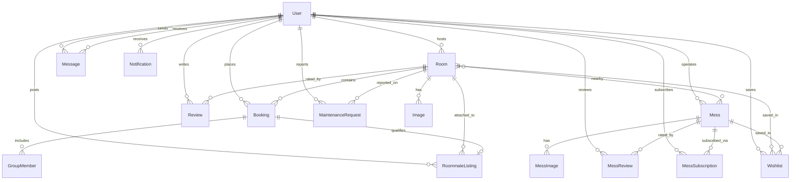

# Homely 🏠✨


> A premium discovery & booking web application for student hostels, tiffin mess subscriptions, and roommate matching. Designed with modern UX, interactive maps, and student compatibility tags.

---

## 🚀 Key Features

### 1. Hostel Discovery & Bookings
* Browse rooms, hostels, and PGs with a cinematic photo grid, reviews, pricing, and distance parameters.
* Interactive map integration using Advanced Markers showing student-specific locations and neighborhood essentials (Libraries, Hospitals, Late-Night Food Points).
* Real-time room booking flow with secure group/shared room invitations.

### 2. Tiffin Mess Discovery & Subscriptions
* Subscriptions for Veg/Non-Veg/Both dining plans with reviews and location badges.
* Integrated tiffin service reviews, overall ratings, and location proximity filters.

### 3. Roommate Required Listings 👥
* **Confirmed Booking Gating**: Verified tenants with active confirmed room bookings can publish public roommate request advertisements.
* **Compatibility Tagging**: Auto-prefills and matches roommates based on habits: Study Style (Quiet, Group, Flexible), Social Vibe (Introvert, Extrovert, Balanced), Cleanliness Indexes, Smoking preferences, and Dietary choices.
* **Notice Bulletin Board**: All published roommate ads are displayed on a dedicated tab on the Home page as notice cards with detail modals.
* **In-app Chat Connect**: Direct linking to in-app messaging threads to instantly coordinate flatshares.

### 4. Interactive Profile Settings
* Custom, tabbed profile controller to manage **Personal Info** (Name, College, Bio), **Account Settings** (Preferences, clean/diet tags), **Security & Privacy** (Password change, custom toggle controls for profile visibility), and **Roommate Ad** (publish/edit/delete roommate requests).

### 5. Notifications
* Real-time updates for bookings, message requests, and landlord responses powered by Socket.io.

### 6. Full Dark Theme Support
* Native styling transitions with complete visual visibility checks for all text, icons, forms, interactive map markers, and primary buttons.

---

## 🛠️ Tech Stack

| Layer | Technologies |
|:---|:---|
| **Frontend** | React 19 (Vite SPA), Tailwind CSS v4, Lucide Icons, Google Maps React API, Framer Motion |
| **Backend** | Node.js, Express.js, Socket.io |
| **Database** | Prisma ORM, SQLite (`prisma/dev.db` for fully offline development) |
| **Auth** | JWT (JSON Web Tokens), bcrypt password hashing |

---

## 🗂️ Database Schema



---


## 📂 Project Structure

```
├── client/                 # React Frontend (Vite)
│   ├── src/
│   │   ├── components/    # Reusable UI (RoomCard, MessCard, Map, Layout)
│   │   ├── context/       # AuthContext, ThemeContext
│   │   └── pages/         # Home, Auth, Profile, Details
│   └── package.json
└── server/                 # Express Backend
    ├── prisma/             # Schema configuration, migrations, seed scripts
    ├── routes/             # REST API routers (auth, rooms, messes, roommates, etc.)
    ├── server.js           # Server initialization and Socket.io setups
    └── package.json
```

---

## ⚙️ Quick Start Setup

Follow these steps to run the application completely offline:

### Prerequisites
Make sure you have **Node.js** (v18+) and **npm** installed.

### 1. Clone the Repository
```bash
git clone https://github.com/adwaitumredkar1818/Homely.git
cd Homely
```

### 2. Setup the Backend Server
```bash
# Navigate to the server folder
cd server

# Install dependencies
npm install

# Run database schema push & generate client
npx prisma db push

# Seed the database with sample listings, user credentials, and active requests
node prisma/seed.js

# Start the local API server
node server
```

### 3. Setup the Frontend Client
```bash
# Navigate to client folder in a new terminal window
cd client

# Install dependencies
npm install

# Start the Vite development server
npm run dev
```

The client will be running locally at **[http://localhost:5173](http://localhost:5173)**.

---

## 🔑 Test Credentials

Use these seeded accounts to log in and inspect the features:

| Account Type | Email | Password | Role | Features |
|:---|:---|:---|:---|:---|
| **Student Tenant** | `tenant@test.com` | `password123` | `TENANT` | Book hostels, subscribe to messes, browse/post roommate listings |
| **Landlord Host** | `host@test.com` | `password123` | `HOST` | Manage reservations, upload listings, inspect metrics |

---

## 📸 Screenshots

> **Note**: Screenshots coming soon! Run the app locally to explore the full UI.

| Feature | Description |
|:---|:---|
| 🏠 **Home Page** | Toggle between Hostels, Messes, and the Notice Board with a premium sliding pill selector |
| 🗺️ **Interactive Map** | Google Maps with Advanced Markers showing nearby essentials |
| 👥 **Notice Board** | Roommate notice cards with detail modals and direct chat links |
| ⚙️ **Profile Dashboard** | Tabbed settings with Personal Info, Account, Security, and Roommate Ad management |
| 🌙 **Dark Mode** | Full dark theme support with audited contrast across all components |

---

## 📄 License

This project is for educational and portfolio purposes.

---

<p align="center">
  Made with ❤️ by <a href="https://github.com/adwaitumredkar1818">Adwait Umredkar</a>
</p>
