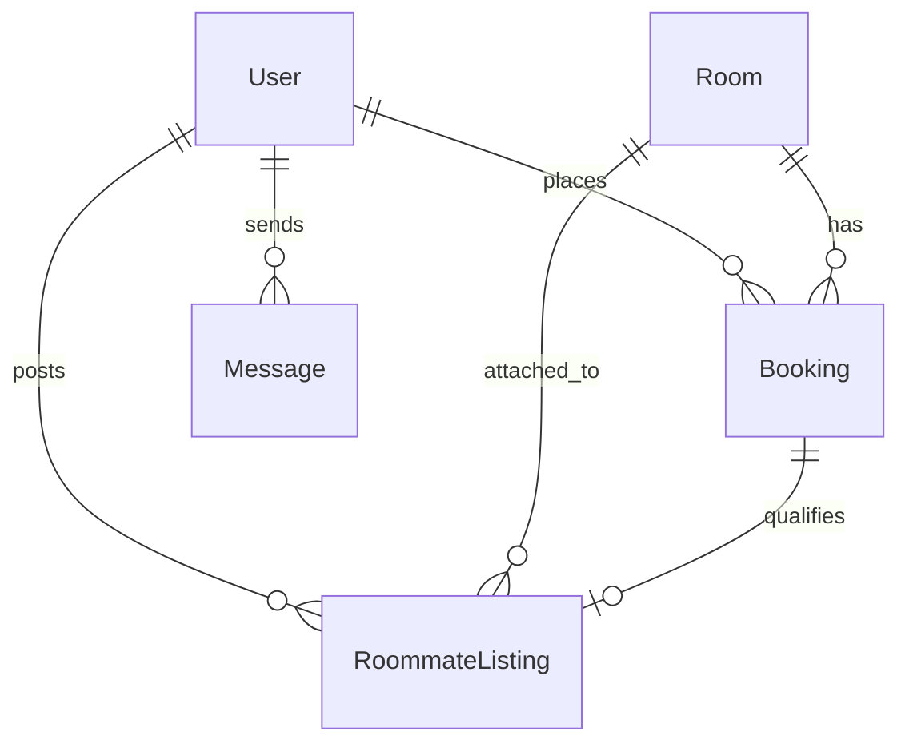

# Homely 🏠✨

Homely is a premium student-housing and dining discovery web application. It connects students searching for hostel accommodations and tiffin mess subscriptions with landlords, tiffin service operators, and compatible flatmates.

<p align="left">
  
  
  
  
  
  
</p>

---

## 🚀 Key Features

### 1. Hostel Discovery & Bookings
* Browse rooms, hostels, and PGs with a custom photo grid, reviews, pricing, and distance parameters.
* Interactive map integration using Advanced Markers showing student-specific locations and neighborhood essentials (Libraries, Hospitals, Late-Night Food Points).
* Real-time room booking flow with secure group/shared room invitations.

### 2. Tiffin Mess Discovery & Subscriptions
* Subscriptions for Veg/Non-Veg/Both dining plans with reviews and location badges.
* Integrated tiffin service reviews, overall ratings, and location proximity filters.

### 3. Roommate Required Listings 👥
* **Confirmed Booking Gating**: Verified tenants with active confirmed room bookings can publish public roommate request advertisements.
* **Compatibility Tagging**: Auto-prefills and matches roommates based on habits: Study Style (Quiet, Group, Flexible), Social Vibe (Introvert, Extrovert, Balanced), Cleanliness Indexes, Smoking preferences, and Dietary choices.
* **In-app Chat Connect**: Direct linking to in-app messaging threads to instantly coordinate flatshares.

### 4. Interactive Profile Settings & Dashboard
* Custom, tabbed profile controller to manage **Personal Info** (Name, Bio, College), **Account Settings** (Preferences, clean/diet tags), and **Security & Privacy** (Password change, custom toggle controls for profile visibility).
* Inline Roommate Ad manager directly in the dashboard, enabling users to create, update, and delete their ads.

### 5. Notifications
* Real-time updates for bookings, message requests, and landlord responses powered by Socket.io.

### 6. Full Dark Theme Support
* Native styling transitions with complete visual visibility checks for all text, icons, forms, interactive map markers, and primary buttons.

---

## 📐 Database Architecture

The diagram below details the data relationships between users, listings, bookings, and roommate requests:



---

## 🌐 API Reference

### Auth Endpoints
* `POST /api/auth/register` - Create a student or host account.
* `POST /api/auth/login` - Authenticate and return JWT token.

### Listing & Bookings
* `GET /api/rooms` - Query and filter available room listings.
* `POST /api/bookings` - Submit mock credit card information to secure booking.

### Roommates Notice Board
* `GET /api/roommates` - Browse all active roommate request notices.
* `POST /api/roommates` - Create roommate request (requires active booking).
* `DELETE /api/roommates/:id` - Deactivate/Delete roommate request notice.

---

## 📂 Project Structure

```
├── client/                 # React Frontend (Vite)
│   ├── src/
│   │   ├── components/    # Reusable UI (RoomCard, MessCard, Map, Layout)
│   │   ├── context/       # AuthContext, ThemeContext
│   │   └── pages/         # Home, Auth, Profile, Details
│   └── package.json
└── server/                 # Express Backend
    ├── prisma/             # Schema configuration, migrations, seed scripts
    ├── routes/             # REST API routers (auth, rooms, messes, roommates)
    ├── server.js           # Server initialization and Socket.io setups
    └── package.json
```

---

## ⚙️ Quick Start Setup

Follow these steps to clone and run the application completely offline:

### 1. Clone the Repository
```bash
# Clone the repository
git clone https://github.com/adwaitumredkar1818/Homely.git

# Navigate into the project root directory
cd Homely
```

### 2. Setup the Backend Server
```bash
# Navigate to the server folder
cd server

# Install dependencies
npm install

# Run database schema push & generate client
npx prisma db push

# Seed the database with sample listings, user credentials, and active requests
node prisma/seed.js

# Start the local API server
node server
```

### 3. Setup the Frontend Client
```bash
# Navigate to client folder in a new terminal window
cd client

# Install dependencies
npm install

# Start the Vite development server
npm run dev
```

The client will be running locally at **[http://localhost:5173](http://localhost:5173)**.

---

## 🔑 Test Credentials

Use these seeded accounts to log in and inspect the features:

| Account Type | Email | Password | Role | Features |
|---|---|---|---|---|
| **Student Tenant** | `tenant@test.com` | `password123` | `TENANT` | Book hostels, subscribe to messes, browse/post roommate listings |
| **Landlord Host** | `host@test.com` | `password123` | `HOST` | Manage reservations, upload listings, inspect metrics |
