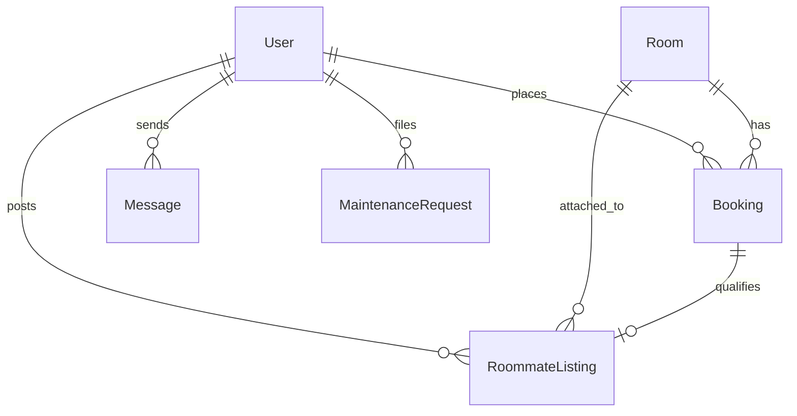
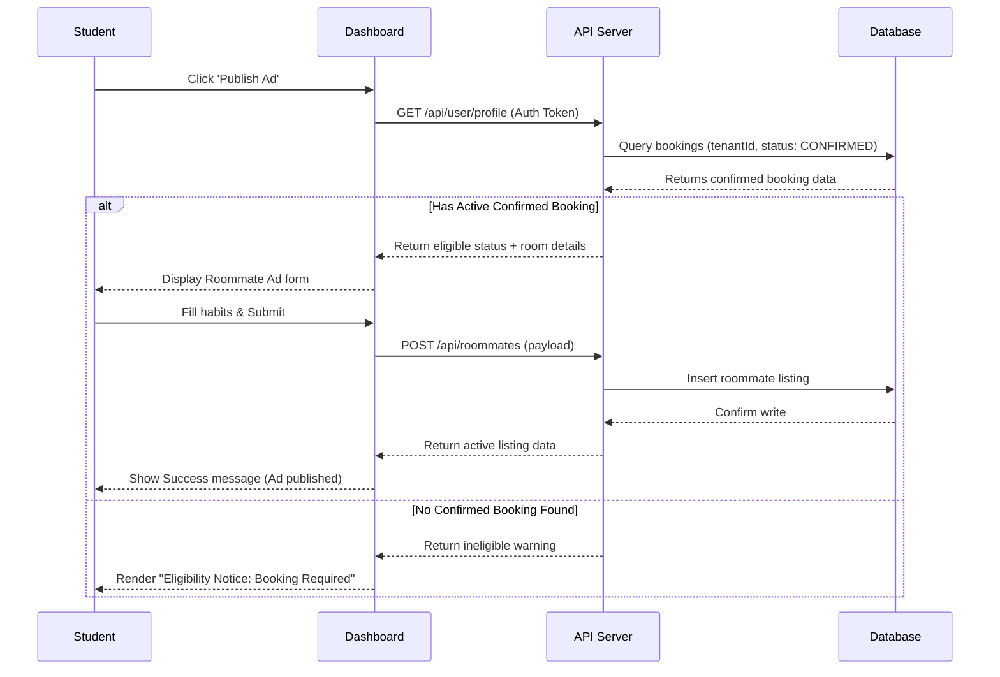

# Homely 🏠✨

Homely is a premium student-housing and dining discovery web application. It connects students searching for hostel accommodations and tiffin mess subscriptions with landlords, tiffin service operators, and compatible flatmates.

<p align="left">
  
  
  
  
  
  
</p>

---

## 🚀 Core Modules & Features

### 1. Hostel Discovery & Booking
* **Photo Grid & Details**: Visual previews of properties, detailed summaries of pricing, room options, reviews, and specific locations.
* **Neighborhood Essentials Map**: Integrated Google Maps dynamically rendering hostel locations alongside nearby student amenities (Libraries, Maggi Points, Hospitals).
* **Booking System**: Interactive mock card payment form that securely handles validation using dynamically generated date-selection calendars.

### 2. Dining Tiffin Mess Discovery
* **Subscription Management**: Student dining plans (Veg, Non-Veg, Both) complete with monthly price structures.
* **Location-Based Filtering**: Easy proximity check for homemade dining options nearest to target college campuses.

### 3. Gated Roommate Requests (Notice Board) 👥
* **Security Validation**: Prevents spam or fake profiles. Roommate requests are gated and can only be published by students with a *confirmed room booking*.
* **Custom Habit Matching**: Students pre-select compatibility criteria (Quiet/Group Study, Social/Introvert Vibe, Cleanliness Level (1-5), Smoking, and Vegetarian choices).
* **Direct Messaging Link**: Instant routing to secure text dialog threads with roommate ad posters.

### 4. Interactive Profile Dashboard
* **Profile Management**: Update names, student bio details, current college affiliations, and individual habit configurations.
* **Inline Roommate Ad Editor**: Seamlessly publish, edit, deactivate, or delete active listings directly inside the profile settings panel.
* **Security & Privacy Settings**: Password updates and custom settings for account privacy.

### 5. Real-Time Interactions
* **Instant Chat & Inbox**: Text dialog box for roommate candidates to schedule meetings or coordinate bookings.
* **Live Notifications**: In-app popups and status counts tracking message receipts and landlord actions powered by Socket.io.

### 6. Universal Dark Theme Support
* Curated theme configuration swapping light-mode warm beige palettes with high-contrast dark navy backgrounds. Checked for perfect text, border, button, and indicator readability.

---

## 📐 System Architecture & Diagrams

### Database Entity Relationship Model


### Roommate Listing Gating Sequence Flow


---

## ⚙️ Environment Variables Configuration

Make sure the following variables are configured correctly before running the services:

### Backend Configuration (`server/.env`)
Create a `.env` file in the `server/` directory:
```env
PORT=5000
JWT_SECRET=your_jwt_secret_key_string
```

### Frontend Configuration (`client/.env`)
Create a `.env` file in the `client/` directory:
```env
VITE_GOOGLE_MAPS_API_KEY=your_google_maps_api_key
```

---

## 🌐 API Reference

### Authentication Endpoints
* `POST /api/auth/register` - Create user accounts (Student or Host).
* `POST /api/auth/login` - Authenticate account and retrieve jwt access token.

### Rooms & Properties
* `GET /api/rooms` - Browse and filter room listings.
* `GET /api/rooms/:id` - Fetch room details, images, and reviews.
* `POST /api/rooms` - Create property listing (Hosts only).

### Tiffin Mess Services
* `GET /api/messes` - Browse messes.
* `GET /api/messes/:id` - Fetch tiffin menu, ratings, and subscription choices.

### Roommate Listings
* `GET /api/roommates` - Fetch active roommate board entries.
* `POST /api/roommates` - Create roommate request (gated).
* `PUT /api/roommates/:id` - Modify an active roommate request ad.
* `DELETE /api/roommates/:id` - Remove a roommate request ad.

### Messaging & Tickets
* `POST /api/messages/conversations` - Open or fetch message conversations.
* `GET /api/messages/:convId` - Load chat history.
* `POST /api/maintenance` - File maintenance support requests.

---

## 📂 Project Structure

```
├── client/                 # React Frontend (Vite)
│   ├── src/
│   │   ├── components/    # Reusable UI (RoomCard, MessCard, Map, Layout)
│   │   ├── context/       # AuthContext, ThemeContext
│   │   └── pages/         # Home, Auth, Profile, Details
│   └── package.json
└── server/                 # Express Backend
    ├── prisma/             # Schema configuration, migrations, seed scripts
    ├── routes/             # REST API routers (auth, rooms, messes, roommates)
    ├── server.js           # Server initialization and Socket.io setups
    └── package.json
```

---

## 🛠️ Quick Start Setup

### 1. Clone the Repository
```bash
# Clone the repository
git clone https://github.com/adwaitumredkar1818/Homely.git

# Navigate into the project root directory
cd Homely
```

### 2. Setup the Backend Server
```bash
# Navigate to the server folder
cd server

# Install dependencies
npm install

# Run database schema push & generate client
npx prisma db push

# Seed the database with sample listings, user credentials, and active requests
node prisma/seed.js

# Start the local API server
node server
```

### 3. Setup the Frontend Client
```bash
# Navigate to client folder in a new terminal window
cd client

# Install dependencies
npm install

# Start the Vite development server
npm run dev
```

The client will be running locally at **[http://localhost:5173](http://localhost:5173)**.

---

## 🔑 Test Credentials

Use these seeded accounts to log in and inspect the features:

| Account Type | Email | Password | Role | Features |
|---|---|---|---|---|
| **Student Tenant** | `tenant@test.com` | `password123` | `TENANT` | Book hostels, subscribe to messes, browse/post roommate listings |
| **Landlord Host** | `host@test.com` | `password123` | `HOST` | Manage reservations, upload listings, inspect metrics |

---

## 🔍 Troubleshooting & FAQs

#### Q: The database setup fails or throws database locks.
Run `npx prisma db push --force-reset` inside the `server/` directory to clear any active file locks on the local SQLite DB file and restart the server.

#### Q: Google Maps are not rendering correctly or show warning alerts.
Check that the Google Maps Javascript API, Places API, and Geocoding API are enabled under your Google Cloud console credentials, and verify the API key matches in `client/.env`.

#### Q: Port 5000 is already in use error.
Stop any running node server tasks using `Stop-Process` (Windows) or `kill` (Mac/Linux), or modify the `PORT` key inside the server's `.env` config file.
